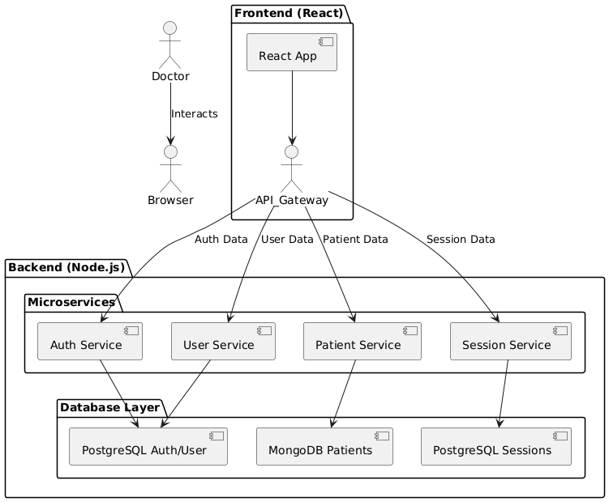

# Clinical Records Microservices Application

## Overview

The Clinical Records application is a management system designed to handle information about doctors and patients using a microservices architecture. The solution uses React for the frontend and Node.js for the backend, providing a scalable and modular approach for managing medical data and related processes.

## Project Structure

The project consists of several independent microservices and a frontend, each with its own repository. The architecture is designed to allow independent deployment and scaling of each component.

### Microservices

1. **Auth Service**
    - **Description**: Manages user (doctor) registration, login, and permissions.
    - **Technologies**: Node.js, Express, PostgreSQL
    - **Directory**: [auth-service](./auth-service)

2. **User Service**
    - **Description**: Maintains doctor information, such as profiles and specialties.
    - **Technologies**: Node.js, Express, PostgreSQL
    - **Directory**: [user-service](./user-service)

3. **Patient Service**
    - **Description**: Stores and manages patient information, including personal data and medical histories.
    - **Technologies**: Node.js, Express, MongoDB
    - **Directory**: [patient-service](./patient-service)

4. **Session Service**
    - **Description**: Manages admissions, session closures, and regular sessions (daily or weekly).
    - **Technologies**: Node.js, Express, PostgreSQL or InfluxDB
    - **Directory**: [session-service](./session-service)

5. **API Gateway**
    - **Description**: Centralizes frontend requests and routes them to the appropriate microservices. Handles authentication, routing, and load balancing.
    - **Technologies**: Node.js, Express or Fastify
    - **Directory**: [api-gateway](./api-gateway)

### Frontend

- **Description**: Web application developed in React for user interaction with the clinical records management system.
- **Technologies**: React, Formik
- **Directory**: [frontend](./frontend)

## Technologies Used

- **Frontend**: React, Formik
- **Backend**:
    - **Auth Service**: Node.js, Express, PostgreSQL
    - **User Service**: Node.js, Express, PostgreSQL
    - **Patient Service**: Node.js, Express, MongoDB
    - **Session Service**: Node.js, Express, PostgreSQL or InfluxDB
    - **API Gateway**: Node.js, Express or Fastify

## Repository Structure

Each microservice and the frontend are organized into separate repositories to facilitate development, deployment, and maintenance. Below is the basic directory structure for each repository:

- **api-gateway/**
    - `src/`
    - `routes/`
    - `middlewares/`
    - `Dockerfile`

- **auth-service/**
    - `src/`
    - `controllers/`
    - `models/`
    - `Dockerfile`

- **user-service/**
    - `src/`
    - `controllers/`
    - `models/`
    - `Dockerfile`

- **patient-service/**
    - `src/`
    - `controllers/`
    - `models/`
    - `Dockerfile`

- **session-service/**
    - `src/`
    - `controllers/`
    - `models/`
    - `Dockerfile`

- **frontend/**
    - `src/`
    - `components/`
    - `services/`
    - `Dockerfile`

## Architecture Diagram

Below is a simplified diagram of the application's architecture:

## Deployment

Each microservice and the frontend can be deployed using Docker, with each component having its own `Dockerfile`. This facilitates deployment in any Docker-compatible environment.

## License

This project is licensed under the [MIT License](./LICENSE).

---

For any questions or support, please contact [julianricomagno@gmail.com](mailto:your-email@example.com).

